# Inventory Supply Management

<p align="center">
  Polyglot microservices platform for inventory, warehousing, fleet, ordering, and company operations.
</p>

<p align="center">
  
  
  
  
  
  
  
</p>

## Overview

This repository contains an ERP-style inventory and supply management system built as a polyglot microservices monorepo.

The current implementation combines:

- an Angular 21 frontend
- a Spring Cloud Gateway entrypoint
- Spring Boot services for authentication, companies, warehouses, and inventory
- .NET 9 services for fleet, products, and orders
- a Node.js notification service with HTTP and WebSocket delivery
- PostgreSQL per service, Kafka for asynchronous events, and gRPC between orders and inventory

## Highlights

- Role-aware authentication with JWT stored in an `HttpOnly` cookie
- Central gateway routing for all business APIs
- Warehouse, company, product, stock, order, driver, and vehicle management modules
- Kafka-based event flow for operational notifications
- Real-time notification push over WebSocket
- gRPC integration from `order-service` to `inventory-service`
- Docker Compose infrastructure for databases, Kafka, Zookeeper, and nginx
- `tmux` launcher for running the full local development stack in one command

## Architecture

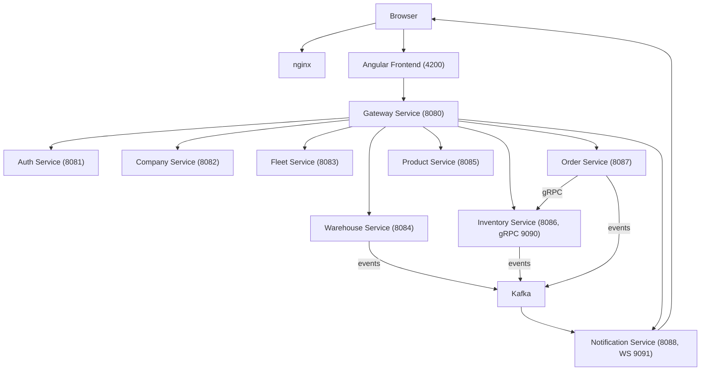

## Screenshots

<p align="center">
  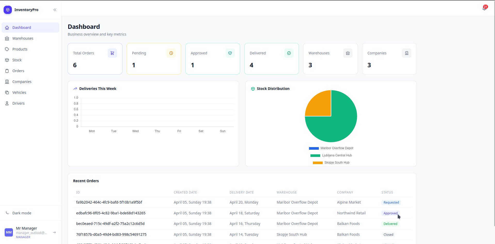
  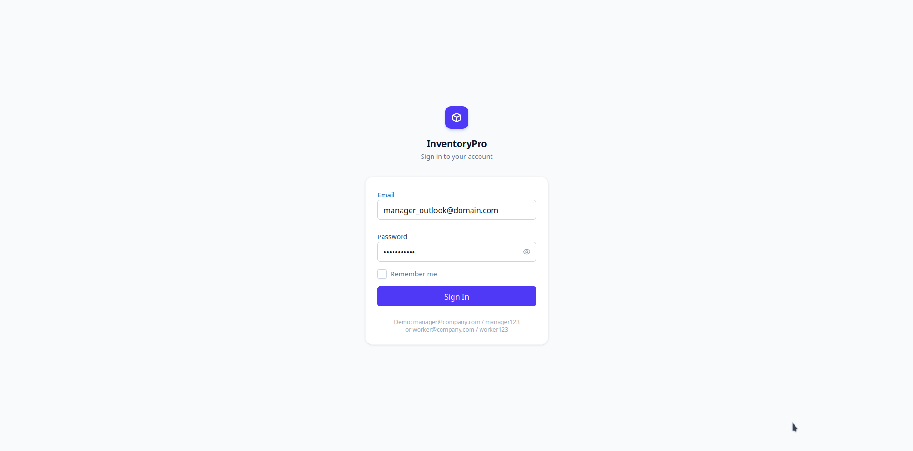
</p>

<p align="center">
  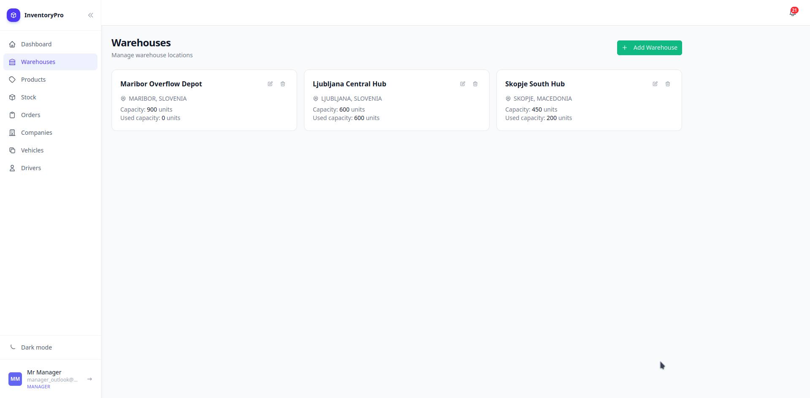
  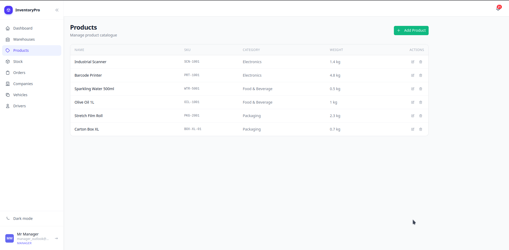
</p>

<p align="center">
  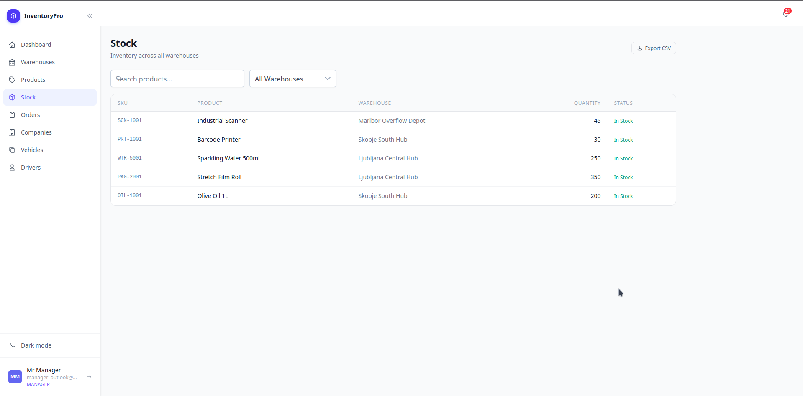
  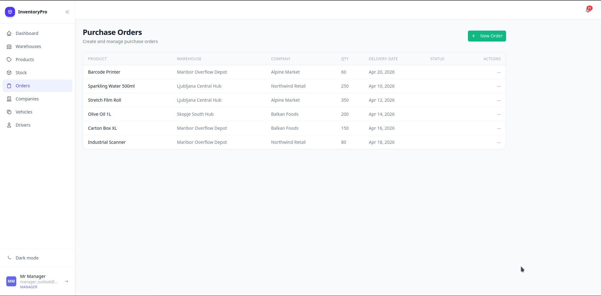
</p>

<p align="center">
  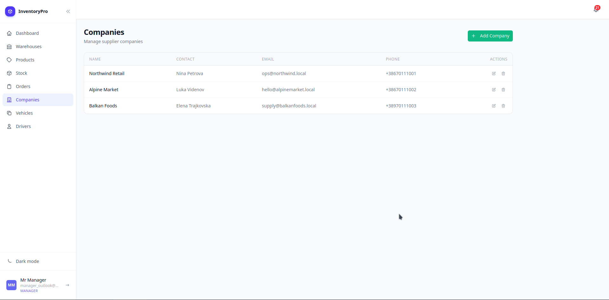
  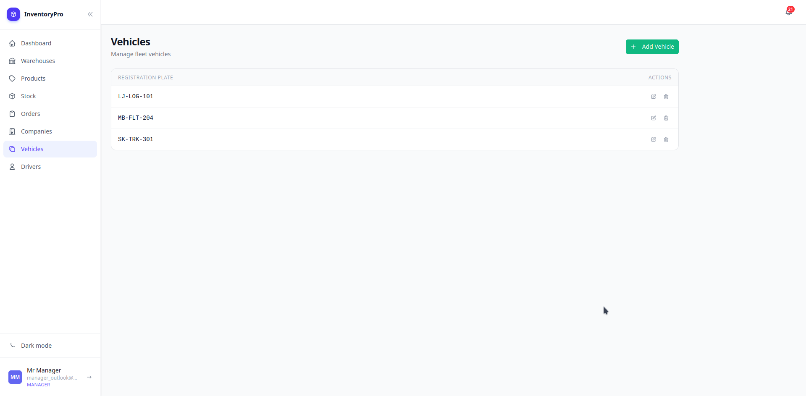
</p>

<p align="center">
  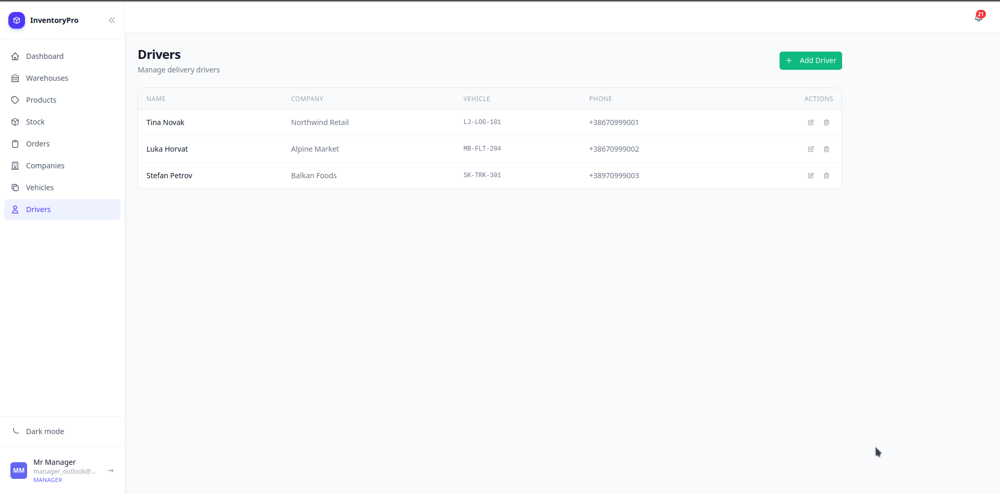
  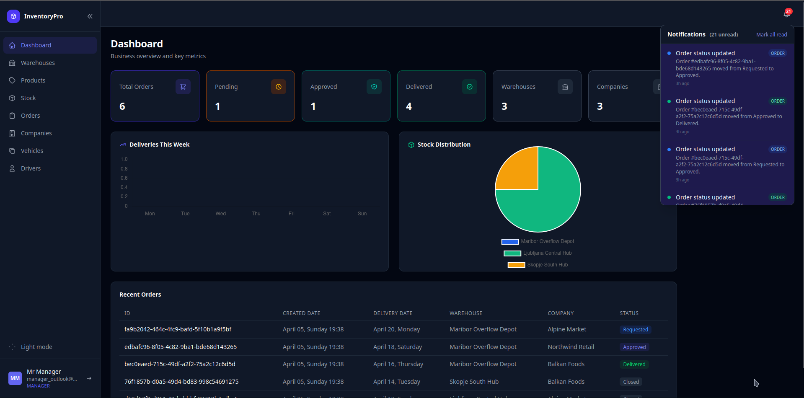
</p>

## Services

| Module | Stack | Port(s) | Responsibility |
| --- | --- | --- | --- |
| `web-app/inventory-system-frontend` | Angular 21 + PrimeNG | `4200` | UI for dashboard, warehouses, products, stock, orders, companies, vehicles, drivers, and settings |
| `gateway-service` | Spring Cloud Gateway + WebFlux | `8080` | Single API entrypoint, JWT validation, route forwarding |
| `services/auth-service` | Spring Boot | `8081` | Login, registration, logout, cookie-based auth |
| `services/company-service` | Spring Boot | `8082` | Company CRUD and totals |
| `services/fleet-service` | ASP.NET Core | `8083` | Driver and vehicle management |
| `services/warehouse-service` | Spring Boot | `8084` | Warehouse CRUD, totals, inventory-capacity events |
| `services/product-service` | ASP.NET Core | `8085` | Product and category management |
| `services/inventory-service` | Spring Boot + gRPC | `8086`, `9090` | Inventory REST API, stock updates, gRPC server |
| `services/order-service` | ASP.NET Core + gRPC client | `8087` | Order lifecycle, status updates, document upload |
| `services/notification-service` | Node.js + TypeScript | `8088`, `9091` | Notification history API, Kafka consumers, WebSocket broadcasting |

## API Surface

The gateway forwards these paths:

- `/auth/**` -> `auth-service`
- `/companies/**` -> `company-service`
- `/drivers/**`, `/vehicles/**` -> `fleet-service`
- `/warehouses/**` -> `warehouse-service`
- `/products/**`, `/categories/**` -> `product-service`
- `/inventory/**` -> `inventory-service`
- `/orders/**` -> `order-service`
- `/notifications/**` -> `notification-service`

The frontend currently calls those APIs through `/api/*` URLs and expects a reverse proxy in front of the stack.

## Local Development

### Prerequisites

- Docker and Docker Compose
- `tmux`
- JDK 21
- Maven
- .NET 9 SDK
- Node.js 20+
- npm 11+

### 1. Start infrastructure

The current `compose.yaml` brings up infrastructure services and nginx. Most application services are still intended to run locally from source.

```bash
docker compose up -d
```

This provisions:

- nginx
- zookeeper
- kafka
- `auth-db` on `5432`
- `company-db` on `5433`
- `fleet-db` on `5434`
- `warehouse-db` on `5435`
- `product-db` on `5436`
- `inventory-db` on `5437`
- `order-db` on `5438`
- `notification-db` on `5439`

### 2. Install Node dependencies

```bash
cd services/notification-service && npm install
cd ../../web-app/inventory-system-frontend && npm install
```

### 3. Launch the app stack

Use the bundled `tmux` launcher to open the full development workspace:

```bash
./scripts/start-tmux.sh
```

If you also want the script to bring up Docker infrastructure first:

```bash
START_INFRA=1 ./scripts/start-tmux.sh
```

The launcher starts:

- gateway
- auth service
- company service
- inventory service
- warehouse service
- fleet service
- order service
- product service
- notification service
- Angular frontend

### 4. Open the app

- `http://localhost` for the nginx entrypoint
- `http://localhost:4200` for the Angular dev server
- `http://localhost:8080` for the gateway

## Running Services Manually

If you prefer to start services one by one:

```bash
cd gateway-service && mvn spring-boot:run
cd services/auth-service && mvn spring-boot:run
cd services/company-service && mvn spring-boot:run
cd services/warehouse-service && mvn spring-boot:run
cd services/inventory-service && mvn spring-boot:run

cd services/fleet-service && dotnet run
cd services/product-service && dotnet run
cd services/order-service && dotnet run

cd services/notification-service && npm run dev
cd web-app/inventory-system-frontend && npm start
```

## Developer Notes

- `compose.yaml` currently acts primarily as infrastructure orchestration; most application containers are commented out.
- The frontend module names visible in navigation are: Dashboard, Warehouses, Products, Stock, Orders, Companies, Vehicles, Drivers, and Settings.
- `inventory-service` exposes both REST and gRPC, and `order-service` consumes the gRPC contract from `Protos/inventory.proto`.
- The notification service persists notifications to PostgreSQL, exposes HTTP history endpoints, and broadcasts live events over WebSocket.

## Project Structure

```text
.
├── .github/workflows/         # CI jobs
├── gateway-service/           # Spring Cloud Gateway
├── services/
│   ├── auth-service/          # Spring Boot auth
│   ├── company-service/       # Spring Boot company domain
│   ├── fleet-service/         # ASP.NET Core fleet domain
│   ├── inventory-service/     # Spring Boot inventory + gRPC
│   ├── notification-service/  # Node.js notifications + WebSocket
│   ├── order-service/         # ASP.NET Core orders + gRPC client
│   ├── product-service/       # ASP.NET Core products + categories
│   └── warehouse-service/     # Spring Boot warehouse domain
├── scripts/
│   └── start-tmux.sh          # Local dev launcher
├── web-app/
│   └── inventory-system-frontend/
├── compose.yaml               # Infrastructure stack
└── nginx.conf                 # Reverse proxy config
```

## Testing And CI

Current CI is defined in `.github/workflows/ci.yml` and includes jobs for:

- `warehouse-service`
- `inventory-service`
- `order-service`
- `notification-service`

Local test commands vary by stack:

```bash
cd services/warehouse-service && mvn test
cd services/inventory-service && mvn test
cd services/order-service && dotnet test
cd web-app/inventory-system-frontend && npm test
```

## Current State

This repository is already in a productive development shape, but it is still evolving. The current branch reflects an in-progress, actively integrated system rather than a fully standardized production release.

The strongest parts of the current setup are:

- clear domain separation across services
- a practical local development launcher
- working event-driven and gRPC integration paths
- a modern frontend stack with protected routes and dashboard modules

The main areas still worth tightening are:

- environment and secret management
- consistency of local proxying and container networking
- endpoint and contract polish in a few services
- broader CI coverage across the full monorepo
